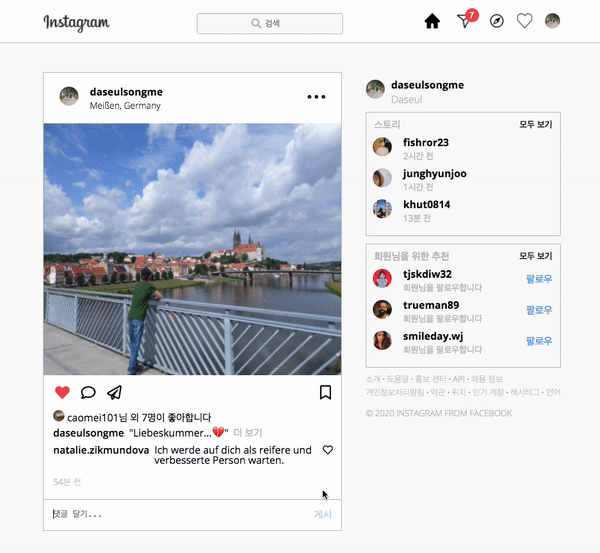

A clone of <a href="https://www.instagram.com/" target="blank">Instagram</a>

Built with <a href="https://www.w3.org/html/" target="blank">HTML</a> , <a href="https://www.w3.org/Style/CSS/Overview.en.html" target="blank">CSS</a> and <a href="https://javascript.info/" target="blank">JavaScript</a>

---

<a href="#"><strong>DEMO</strong></a>

## What's next

---

- [ ] ID, Password validation (ex. id must include '@', pw has more than 5 characters or numbers)
- [ ] Responsive Web design
- [ ] See more & hide content
- [ ] Delete comment
- [ ] Like button
